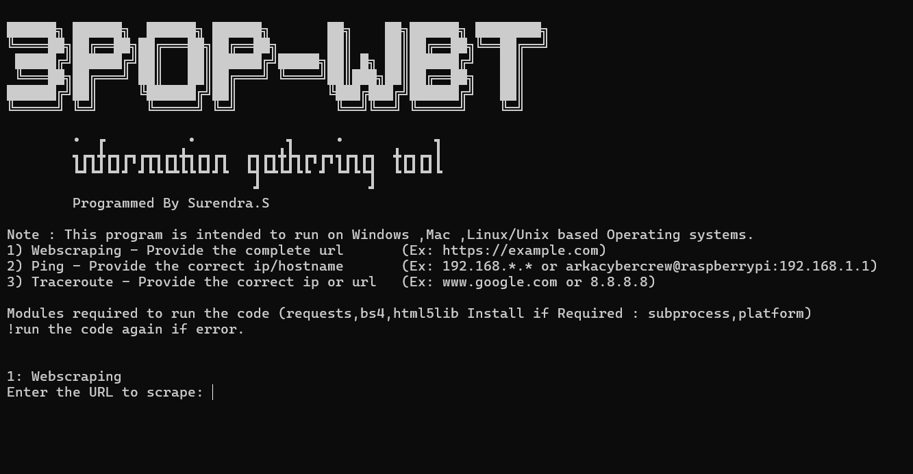

# 3pop-wbt

A simple command-line tool for basic web scraping, ping testing, and traceroute operations. Works on Windows, Linux, and macOS.



## Features

- Web scraping (HTML content preview)
- Ping a target IP or hostname
- Traceroute to a domain or IP
- Cross-platform support

## Requirements
Internet Required !
A system with a python installed.

## Installation 

Step 1 - > Clone this repo .
```bash
git clone https://github.com/surendrasonusep26/3pop-wbt
```
Step 2 - >  Go to 3pop-wbt dir , or copy one by one below commands.
```bash
cd 3pop-wbt
pip install -r requirements.txt
```
Step 3 - > To run .
```bash
python main.py
```
😊
